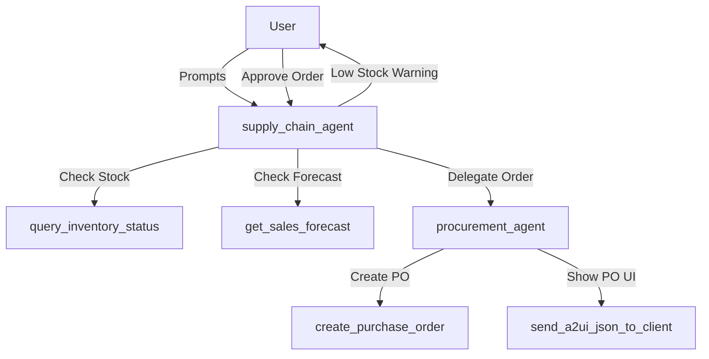

# Agent Architecture

This project implements a multi-agent system for Party Store Supply Chain Management using the Google ADK.

## Root Agent: `supply_chain_agent`
*   **Role:** Supply Chain Optimization Agent
*   **Description:** Manages inventory, forecasts demand, and identifies low-stock items. Orchestrates the workflow and delegates procurement tasks.
*   **Tools:**
    *   `query_inventory_status`: Queries current stock levels.
    *   `get_sales_forecast`: Retrieves sales forecasts.
    *   `send_a2ui_json_to_client`: Renders A2UI payload.
*   **Sub-agents:**
    *   `procurement_agent`

## Sub-agent: `procurement_agent`
*   **Role:** Procurement Agent
*   **Description:** Handles purchasing of inventory.
*   **Tools:**
    *   `create_purchase_order`: Creates a purchase order.
    *   `send_a2ui_json_to_client`: Renders PO confirmation A2UI.

## Delegation Flow

## Gemini Enterprise A2UI rendering (how the demo actually works)

The GE-facing path is a **deterministic A2A executor on Cloud Run**, NOT the ADK LLM tool loop:

- **`app/agent_executor.py` (`PartyStoreExecutor`)** routes each request by intent (inventory /
  forecast / order, plus button `userAction`s), calls the `tools.py` `_fetch_*` + `build_*_payload`
  helpers, and emits each A2UI command as `Part(root=DataPart(data=msg, metadata={"mimeType":
  "application/json+a2ui"}))` via `TaskUpdater.add_artifact(parts, name="response")`. **Without that
  mimeType tag GE silently drops the UI.** This mirrors the proven `rag_pg_ip` pattern.
- **`app/fast_api_app.py`** serves it with `A2AFastAPIApplication` (JSON-RPC) at `/a2a/app`; the card
  advertises the A2UI v0.8 extension (`acceptsInlineCatalogs: true` for the custom VegaChart).
- **Deploy:** `gcloud run deploy party-store-ge-a2ui --source . --region us-east1
  --allow-unauthenticated`. Requires `.python-version` = `3.13` (the buildpack offers only 3.13/3.14
  and `litellm` caps at `<3.14`).
- **Register in GE:** the agent card `url` must be the Cloud Run `/a2a/app` endpoint (see
  `scripts/register_cloud_run_agent.py`). **GE cannot invoke A2A agents on Vertex Agent Runtime** —
  that path degrades the A2UI DataPart to a `text/plain` blob GE won't render.
- The LLM path (`agent.py` + `a2ui_plugin.py` + `send_a2ui_json_to_client`) and `agent_runtime_app.py`
  are kept for the Reasoning Engine Playground only; the tools' payload builders are shared by both.
