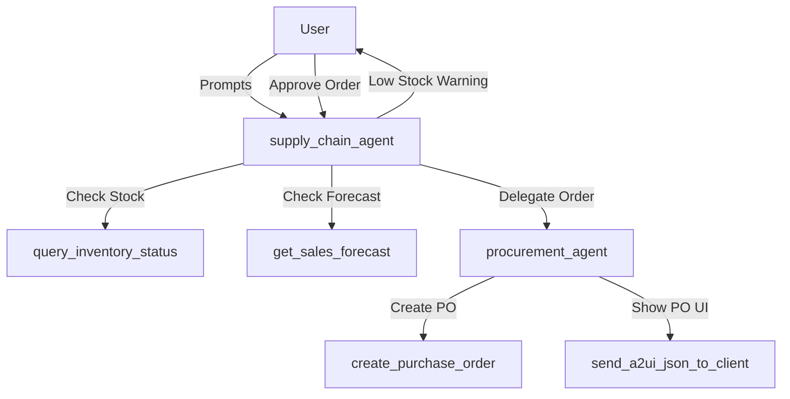

# Agent Architecture

This project implements a multi-agent system for Party Store Supply Chain Management using the Google ADK.

## Root Agent: `supply_chain_agent`
*   **Role:** Supply Chain Optimization Agent
*   **Description:** Manages inventory, forecasts demand, and identifies low-stock items. Orchestrates the workflow and delegates procurement tasks.
*   **Tools:**
    *   `query_inventory_status`: Queries current stock levels.
    *   `get_sales_forecast`: Retrieves sales forecasts.
    *   `send_a2ui_json_to_client`: Renders A2UI payload.
*   **Sub-agents:**
    *   `procurement_agent`

## Sub-agent: `procurement_agent`
*   **Role:** Procurement Agent
*   **Description:** Handles purchasing of inventory.
*   **Tools:**
    *   `create_purchase_order`: Creates a purchase order.
    *   `send_a2ui_json_to_client`: Renders PO confirmation A2UI.

## Delegation Flow

