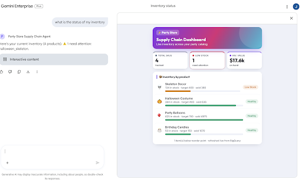
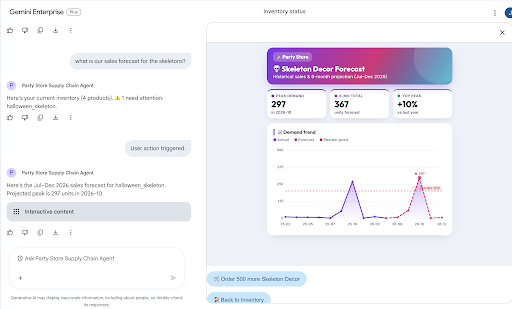
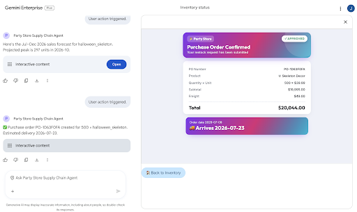

# Party Store Supply Chain Agent

A multi-agent supply chain optimization assistant powered by the Google Agent Development Kit (ADK) and A2UI v0.8.

The agent helps store managers query current inventory levels, inspect sales forecasts with interactive Vega charts, and automatically place purchase orders via sub-agent delegation.

---

## Project Structure

```
party-store-ge-a2ui/
├── app/                        # Core agent code
│   ├── agent.py                # Agent & Sub-agent definitions and prompts
│   ├── agent_executor.py       # Deterministic A2A executor (GE-facing, emits A2UI DataParts)
│   ├── fast_api_app.py         # A2A HTTP server (Cloud Run entrypoint)
│   ├── ui_builder.py           # Festive WebFrameSrcdoc panels (inventory/forecast/PO)
│   ├── tools.py                # BigQuery tools & A2UI payload builders
│   └── ui_examples/            # A2UI Layout spec files (v0.8 format)
├── scripts/
│   ├── deploy_to_ge.sh         # Cloud Run deploy + GE registration
│   ├── register_cloud_run_agent.py  # Point GE at the Cloud Run /a2a/app card
│   ├── list_registered_agents.py    # Inspect GE agent registrations
│   ├── generate_data.py        # Populate mock BigQuery party_store tables
│   ├── test_api.py             # 3-turn async API integration test script
│   └── ui_critic/              # Demo-impact critic flywheel (render + vision critique)
├── AGENTS.md                   # System design & Agent orchestration docs
├── DEPLOY.md                   # Deployment runbook (Cloud Run → GE)
├── README.md                   # Setup and usage guide (this file)
└── pyproject.toml              # Project dependencies
```

---

## Prerequisites

Ensure you have the following installed:
1. **uv**: Fast Python package manager ([Install](https://docs.astral.sh/uv/getting-started/installation/))
2. **google-agents-cli**: installed with `uv tool install google-agents-cli`
3. **gcloud SDK**: authenticated to your Google Cloud project ([Install](https://cloud.google.com/sdk/docs/install))

---

## Getting Started

### 1. Configure GCP Project

Ensure your active gcloud project is set correctly:
```bash
gcloud config set project wortz-project-352116
```

Ensure you have authenticated your application default credentials (ADC):
```bash
gcloud auth application-default login
```

### 2. Install Dependencies

Install all dependencies in the local virtual environment:
```bash
agents-cli install
```

### 3. Initialize Mock BigQuery Data

Run the helper script to create the `party_store` dataset and populate the `shipments` and `orders` tables in BigQuery:
```bash
uv run scripts/generate_data.py
```

---

## Running the Agent

### Option A: Local Dev UI (Playground)

Start the local web UI to interactively chat with the agent and view the rendered A2UI components:
```bash
agents-cli playground
```
Once the server starts, open the Dev UI URL in your browser:
👉 [http://127.0.0.1:8000/dev-ui/?app=app](http://127.0.0.1:8000/dev-ui/?app=app)

### Option B: Programmatic Integration Test

Run the pre-configured 3-turn async test client to simulate a full conversation flow against the local FastAPI server:
```bash
uv run scripts/test_api.py
```

---

## Interactive Demo Script

When testing the agent (either manually in the Playground UI or watching the output of `test_api.py`), use the following sequential prompts to run through the full supply chain workflow:

1. **Query Inventory Status**
   - **Prompt:** `Show inventory status`
   - **Expected Output:** The agent responds with a text summary of current stock and displays the **Inventory Dashboard** showing a list of items and their stock status.

   

2. **Inspect Sales Forecast**
   - **Prompt:** `Show sales forecast for halloween_skeleton`
   - **Expected Output:** The agent responds with forecast numbers and displays the **Sales Forecast Chart** (a Vega-Lite line chart showing actuals vs projections).

   

3. **Place Purchase Order (Delegated)**
   - **Prompt:** `Order 300 halloween_skeletons`
   - **Expected Output:** The parent agent delegates the order to the `procurement_agent` sub-agent. The sub-agent places the order, returns a text confirmation with PO details, and displays the **Purchase Order Confirmation Card**.

   

---

## Architecture & System Design

For a deep dive into the sub-agent delegation workflow and the Python-driven A2UI rendering architecture, refer to the [AGENTS.md](AGENTS.md) documentation.

---

## Deployment to Gemini Enterprise

The agent is served as an **A2A HTTP service on Cloud Run**, and Gemini Enterprise (GE) is registered
against that Cloud Run URL. **GE cannot invoke A2A agents on Vertex Agent Runtime / Reasoning Engine**
— that path degrades the A2UI `DataPart` to a `text/plain` blob and the canvas renders nothing. The
GE-facing entrypoint is `app/fast_api_app.py` (`PartyStoreExecutor` emitting `DataPart`s tagged
`application/json+a2ui`); `agent_runtime_app.py` is kept only for the Reasoning Engine Playground.

**Full runbook: [DEPLOY.md](DEPLOY.md)** — deploy → BigQuery IAM → GE registration → verify, with the
exact commands and troubleshooting (incl. the `.python-version=3.13` buildpack requirement).

### Deploy

One line — clones the repo, deploys to Cloud Run, and registers the agent in Gemini Enterprise.
Requires `git`, `uv`, and an authenticated `gcloud` (`gcloud auth application-default login`):

```bash
curl -fsSL https://raw.githubusercontent.com/jswortz/party-store-ge-a2ui/main/scripts/deploy.sh | bash
```

<details>
<summary>Manual deploy (from a local checkout)</summary>

```bash
# 1. Deploy the A2A server to Cloud Run (buildpacks use the Procfile: uvicorn app.fast_api_app:app)
gcloud run deploy party-store-ge-a2ui --source . --region us-east1 \
  --project wortz-project-352116 --allow-unauthenticated \
  --update-env-vars APP_URL=https://party-store-ge-a2ui-679926387543.us-east1.run.app

# 2. Point the GE agent at the Cloud Run /a2a/app card
uv run python scripts/register_cloud_run_agent.py
```

Or the one-shot local script (enable APIs → Cloud Run deploy → GE re-registration):
`./scripts/deploy_to_ge.sh`

</details>

### Testing the deployed agent

Access the agent in the [Gemini Enterprise Console](https://console.cloud.google.com/gemini-enterprise/locations/global/engines/gemini-enterprise-17634901_1763490144996/overview/dashboard?project=wortz-project-352116)
and run the [Interactive Demo Script](#interactive-demo-script) prompts ("Show inventory status", "Show
sales forecast for halloween_costume", "Order 500 birthday candles") to verify the A2UI panels and
chart render in the canvas. See [DEPLOY.md](DEPLOY.md) → *Verify* for the `curl`/`message/send` checks.

