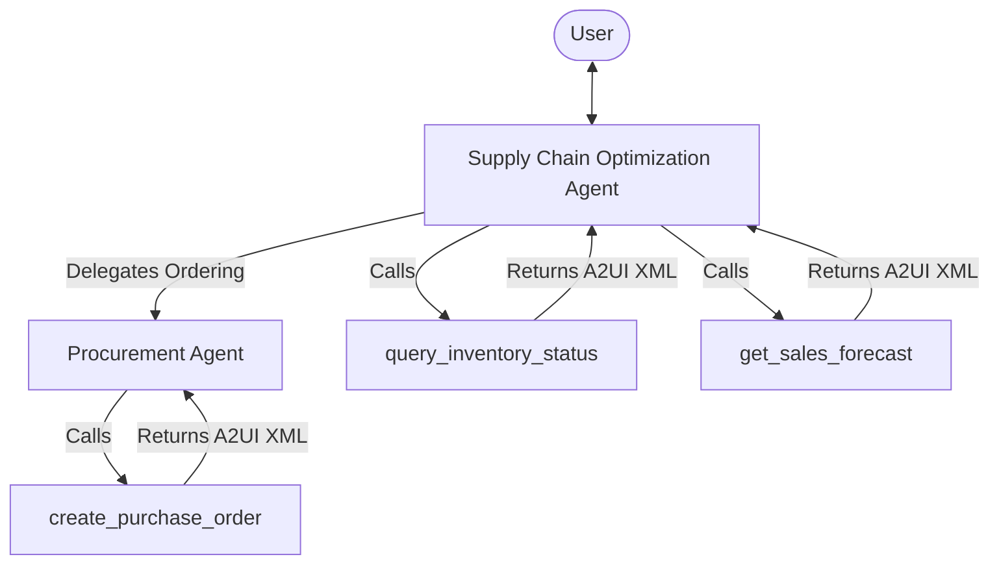

# Party Store Supply Chain Agents

This document describes the multi-agent system built to optimize the supply chain of the Party Store.

## System Overview

The system consists of two specialized agents: a parent **Supply Chain Optimization Agent** and a delegated **Procurement Agent**. Together, they allow users to monitor inventory, view sales forecasts, and place purchase orders. The user experience is enhanced with **A2UI (Agent-to-User Interface) v0.8** components, which render rich dashboards and Vega charts directly in the chat UI.

---

## 1. Supply Chain Optimization Agent

- **System Name:** `supply_chain_agent`
- **Role:** Main coordinator for supply chain queries. It monitors inventory levels, analyzes sales trends, warns about low stock (especially for seasonal spikes), and handles user requests by calling tools or delegating.
- **Model:** `gemini-2.5-flash`
- **Tools:**
  - `query_inventory_status`: Queries BigQuery for current stock levels, received shipments, and sold orders.
  - `get_sales_forecast`: Queries BigQuery for historical sales and computes a 6-month forecast.
- **Sub-Agents:**
  - `procurement_agent` (Delegation target)

### Workflow
1. **Inventory Check:** When asked for inventory status, it calls `query_inventory_status`. The tool automatically generates a text summary and wraps the A2UI inventory dashboard layout in `<a2ui-json>` tags in the tool response.
2. **Sales Forecasting:** When asked about sales forecasts or trends, it calls `get_sales_forecast`. The tool generates a 6-month projection (with seasonal logic for items like Halloween skeletons) and attaches the A2UI Vega-Lite line chart spec.
3. **Ordering delegation:** If it detects low stock or high forecasted demand, it recommends ordering. If the user agrees, it delegates the order request to the `procurement_agent`.

---

## 2. Procurement Agent

- **System Name:** `procurement_agent`
- **Role:** Handles the creation and simulation of purchase orders. It is designed to be delegated to by the `supply_chain_agent` and does not interact with the user directly unless delegated.
- **Model:** `gemini-2.5-flash`
- **Tools:**
  - `create_purchase_order`: Simulates purchase order placement, generates a PO ID, and calculates estimated delivery.

### Workflow
1. **Order Creation:** Receives the delegation request with `product_id` and `quantity`.
2. **Placement & UI:** Calls `create_purchase_order`. The tool returns the order details and automatically attaches the A2UI PO confirmation card payload.
3. **Completion:** Summarizes the purchase order details (PO ID, product, quantity, delivery date) for the user and returns control to the parent agent.

---

## A2UI Rendering Architecture

To prevent JSON formatting and escaping errors common in LLM generation, this project uses a **Python-driven rendering architecture**:

1. **Tool-Side Composition:** The A2UI layout JSON structures (for dashboards, Vega charts, and cards) are constructed programmatically in python inside `app/tools.py`.
2. **Delimited Payload Injection:** The tools serialize the A2UI JSON payload and wrap it in `<a2ui-json>[...]</a2ui-json>` XML tags inside the tool's return string under the `result` key.
3. **Gateway Interception:** The ADK server's `A2uiPartConverter` intercepts the tool response. If it detects `<a2ui-json>` tags, it extracts the JSON, validates it against the schema, and automatically converts it into native A2UI action parts sent to the client.
4. **Agent Simplicity:** Agents do not need to generate any JSON or call the `send_a2ui_json_to_client` tool. They only need to read the data and output conversational text summaries.
